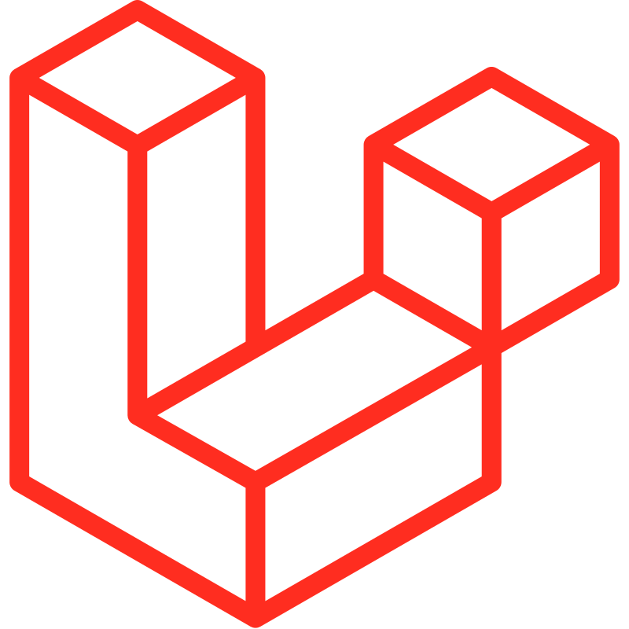

# 👋 Hey there, I'm Prakash KC!

<div align="center">


<h2>Prakash KC</h2>

<p>
Full-Stack Web Developer • MIS Specialist • Technology Learner
</p>

<p>
Building practical web applications, learning modern technologies,
and creating useful digital solutions.
</p>


</div>

---

## 🧑‍💻 About Me

I'm **Prakash KC**, a technology enthusiast focused on web development, full-stack applications, UI/UX design, database systems, and cybersecurity.

I enjoy learning through real-world projects and continuously improving my development, problem-solving, and system-design skills.

```javascript
const prakash = {
    role: "Full-Stack Web Developer",

    interests: [
        "Web Development",
        "Full-Stack Applications",
        "UI/UX Design",
        "Government Digital Systems",
        "Cybersecurity"
    ],

    frontend: [
        "HTML5",
        "CSS3",
        "JavaScript",
        "React",
        "Next.js",
        "Tailwind CSS"
    ],

    backend: [
        "Node.js",
        "Express.js",
        "Laravel",
        "Python"
    ],

    database: [
        "MongoDB",
        "SQL"
    ],

    tools: [
        "Git",
        "GitHub",
        "VS Code",
        "Postman",
        "Figma"
    ],

    philosophy: "Learn → Build → Solve → Improve"
};
```

---

# 🚀 What I Do

<table>
<tr>

<td width="25%" valign="top">

### 🌐 Web Development

* Responsive websites
* Modern UI
* Frontend development
* Full-stack applications
* REST APIs
* Authentication
* Form validation
* Search & filtering

</td>

<td width="25%" valign="top">

### ⚙️ Application Development

* MERN applications
* CRUD systems
* Dashboard systems
* Database applications
* Job portals
* Admin panels
* API integration
* Data management

</td>

<td width="25%" valign="top">

### 🎨 UI/UX & Design

* Figma
* Design systems
* Design tokens
* Typography
* Color systems
* Responsive layouts
* Components
* Accessibility

</td>

<td width="25%" valign="top">

### 🔐 Technology & Security

* Networking
* Firewalls
* Web security
* API security
* Authentication
* Linux
* Windows administration
* Cybersecurity fundamentals

</td>

</tr>
</table>

---

# 🛠️ Tech Stack

## 💻 Languages

<div align="center">


</div>

## ⚛️ Frontend

<div align="center">


</div>

## 🖥️ Backend & Database

<div align="center">




</div>

## 🔧 Tools

<div align="center">


</div>

---

# 📌 Featured Projects

## 💼 MERN Job Portal

A full-stack job marketplace built with React, Node.js, Express.js and MongoDB.

**Features**

* Job seeker & employer accounts
* JWT authentication
* Job posting
* Job search
* Category filtering
* Location filtering
* Salary filtering
* Job type filtering
* Save / unsave jobs
* Job applications
* Employer dashboard
* User profiles
* Application management
* Responsive UI

**Stack:** `React` `Vite` `Tailwind CSS` `Node.js` `Express.js` `MongoDB` `JWT`

---

## 🌦️ Weather & Farming Application

A practical weather application designed around farming and local weather information.

**Features**

* Current weather
* Weather forecast
* Temperature
* Humidity
* Rain information
* Farming recommendations
* Weather alerts
* GPS location
* Interactive maps
* Weather charts
* Air Quality Index
* Dark mode
* PWA support
* Nepali language support

**Stack:** `JavaScript` `Open-Meteo API` `AQI API` `Leaflet` `Chart.js`

---

## 💱 Nepal Currency Converter

A currency conversion application using exchange-rate information.

**Features**

* Currency conversion
* Nepalese Rupee support
* Dynamic conversion
* API integration
* Responsive interface
* Exchange-rate retrieval

**Stack:** `HTML` `CSS` `JavaScript` `Nepal Rastra Bank API`

---

## ✖️ Multiplication Table Generator

Interactive educational web application.

**Features**

* Custom multiplication tables
* Instant calculation
* Dark mode
* Responsive design
* Clean UI

**Stack:** `HTML` `CSS` `JavaScript`

---

## 🎨 Developer Portfolio & Blog

Personal developer platform for projects, articles, experiments, and learning resources.

**Focus**

* Portfolio
* Technical articles
* Project showcase
* Responsive design
* Reusable components
* Modern UI

---

## 🏛️ Government Portal UI/UX System

A design-system project focused on modern government digital services.

**Design System**

* Color tokens
* Typography tokens
* Spacing system
* Sizing system
* Border radius
* Border width
* Opacity
* Shadows
* Components
* Accessibility
* Responsive layouts
* Light / Dark themes

**Tools:** `Figma` `Tokens Studio`

---

# 🧠 Currently Learning

| Area          | Focus                                      |
| ------------- | ------------------------------------------ |
| Frontend      | React, Next.js, Advanced JavaScript        |
| Backend       | Node.js, Express.js, REST APIs             |
| Database      | MongoDB, SQL, Data Modeling                |
| UI/UX         | Figma, Design Systems, Design Tokens       |
| Security      | Web Security, Networking, Firewalls        |
| System Design | Architecture, Scalability & Best Practices |

---

# 🌍 Languages

| Language     | Level            |
| ------------ | ---------------- |
| 🇳🇵 Nepali  | Native           |
| 🇬🇧 English | Pre-Intermediate |

---

# 📊 GitHub Statistics

<div align="center">

<a href="https://github.com/KC-Prakash">

</a>

<a href="https://github.com/KC-Prakash">

</a>

</div>

---

# 🔥 GitHub Streak

<div align="center">


</div>

---

# 📈 GitHub Activity

<div align="center">

<a href="https://github.com/KC-Prakash">


</a>

</div>

---

# 🏆 Achievements

Instead of relying on external GitHub Trophy services that can return errors such as **402 Invalid upstream response**, this profile keeps the achievement section lightweight and reliable.

### 🎯 Development Milestones

* 🚀 Building full-stack web applications
* 💻 Developing MERN-based projects
* 🎨 Learning professional UI/UX systems
* 🧩 Creating reusable UI components
* 🔌 Working with REST APIs
* 🗄️ Working with MongoDB and SQL
* 🔐 Learning cybersecurity fundamentals
* 📚 Continuously improving programming skills

---

# 🧪 Coding & Problem Solving

<div align="center">

<a href="https://www.codewars.com/users/KC-Prakash">


</a>

</div>

---

# 📚 Learning Journey

<details>
<summary>🌐 Web Development</summary>

* HTML5
* CSS3
* JavaScript
* Responsive Design
* Sass
* BEM
* Tailwind CSS
* React
* Next.js
* Redux

</details>

<details>
<summary>⚙️ Backend Development</summary>

* Node.js
* Express.js
* Laravel
* REST API
* Authentication
* Authorization
* JWT
* API Security

</details>

<details>
<summary>🗄️ Database</summary>

* MongoDB
* SQL
* CRUD
* Data Modeling
* Database Relationships
* Query Optimization

</details>

<details>
<summary>🎨 UI/UX</summary>

* Figma
* Design Systems
* Design Tokens
* Typography
* Color Systems
* Spacing
* Components
* Responsive Design
* Accessibility

</details>

<details>
<summary>🔐 Cybersecurity</summary>

* Networking
* Firewalls
* IDS / IPS
* Linux Security
* Windows Security
* Web Security
* API Security

</details>

---

# 🎯 2026 Goals

* [ ] Build production-ready full-stack applications
* [ ] Improve React & Next.js expertise
* [ ] Build scalable REST APIs
* [ ] Improve database architecture
* [ ] Create reusable UI component systems
* [ ] Master Figma design systems
* [ ] Learn advanced cybersecurity
* [ ] Improve Linux & networking skills
* [ ] Contribute to open-source projects
* [ ] Build useful Nepal-focused digital solutions

---

# 💡 Development Philosophy

<div align="center">

### Learn → Build → Experiment → Solve → Improve

</div>

```text
💡 Idea
  ↓
🧠 Learn
  ↓
📝 Plan
  ↓
🎨 Design
  ↓
💻 Build
  ↓
🧪 Test
  ↓
🔍 Debug
  ↓
🚀 Deploy
  ↓
📈 Improve
```

---

# 😄 Fun Facts

<div align="center">


</div>

---

# 📈 Profile Activity

<div align="center">

<a href="https://u8views.com/github/KC-Prakash">


</a>

</div>

---

# 🤝 Let's Connect

<div align="center">

<a href="https://github.com/KC-Prakash">

</a>

<a href="https://www.linkedin.com/">

</a>

<a href="mailto:your-email@example.com">

</a>

</div>

---

# ☕ Support My Work

<div align="center">

<a href="https://www.buymeacoffee.com/prakash_kc">


</a>

</div>

---

<div align="center">

### 💻 Code. Learn. Build. Repeat. 🚀

**Thanks for visiting my profile!**

⭐ Explore my repositories and follow my development journey.

</div>
